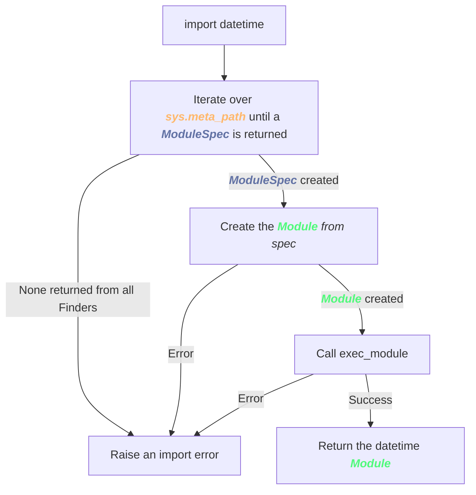

# Hacking The Python Import System
Liad Oz
<br/>
https://github.com/LiadOz/


<!--Explain how the import system works, how to extend it, and show examples. We will look at some source code of python.
The python import machinery is composed of several steps and allows hook into it to extend the standard functionality -->

---

# Terms
From python [glossary](https://docs.python.org/3/glossary.html):

* `Module` - An object that serves as an organizational unit of Python code

* `Package` - A Python module which can contain submodules or recursively, subpackages

* `Loader` - An object that loads a module

* `Finder` - An object that tries to find the loader for a module that is being imported

<!--
Generally people recognize modules as files, that contain functions, variables and class, but it doesn't always have to be that
Most of python packages are directories that contain an __init__.py file

Finders and loaders are components in the python import machinery.
-->

---
layout: cover
class: text-center
---

# Import Machinery

---
layout: default
---

# Finder

```python {all|2}
class MyFinder(importlib.abc.MetaPathFinder):
    def find_spec(self, fullname, path, target = None) -> Optional[ModuleSpec]:
        ...
```

- `fullname` - The full name of the module imported
- `path` - Path of the package the module is imported from
- `return value` - An object that contains the `Loader` that should be used to load the module

<br/>

<v-click>

### Example:
```python
from flask.json import loads
```

<v-click>

- `fullname`: `"flask.json"`
- `path`: `[/Users/loz/workspace/env/lib/python3.8/site-packages/flask]`

</v-click>

</v-click>

<!--
It's important that the path is the path of the package the module is imported from, if no package exists the path is None
target is outside of the scope of this presentation, it is part of the logic that is needed for reloading moudles
The module spec will contain the Loader that the finder defines it should use
-->

---

# Loader

```python {all|2,5}
class MyLoader(importlib.abc.Loader):
    def create_module(self, spec: ModuleSpec) -> ModuleType:
        ...

    def exec_module(self, module: ModuleType) -> None:
        ...
```

- `spec` - The module spec created by `find_spec`
- `module` - The module object created by `create_module`

<br/>
<br/>

<v-click>

### The result of the `create_module` is the module returned from the import statement

</v-click>


<!--
The loading is split into 2 stages, first creating the module object, and then executing code that you want to run when the module is loaded
-->

---

# The Default Finders

```python
import sys
sys.meta_path
```

<br/>

<v-click>

```markdown
[<class '_frozen_importlib.BuiltinImporter'>, 
 <class '_frozen_importlib.FrozenImporter'>, 
 <class '_frozen_importlib_external.PathFinder'>]
```

<v-click>

<br/>

- `BuiltinImporter` - For modules like `sys` and `os`
- `FrozenImporter` - For frozen modules
- `PathFinder` - Modules that are located somewhere in the filesystem like datetime or flask

</v-click>

</v-click>

<!--
So here is where the Finders take into effect, as we said before, finders define what loader will be used, so we will only need to let python import machinery know about the finder.

By default python has 3 Finders, the builtin finder that is used for python's builtin module such as sys and os. the frozen importer is not interesting and the PathFinder is used for most other modules like requests for example
-->

---

# Import Flow

<div style="text-align: center;">

</div>

<!-- Mention how importing then importing again does not change the module becuase of the cached module in sys.modules -->

---
layout: cover
class: text-center
---

# PathFinder

---

# sys.path

Locations where the `PathFinder` searches for packages/modules

System default
```python
sys.path
```
```markdown
['',
 '/Library/Frameworks/Python.framework/Versions/3.8/lib/python38.zip',
 '/Library/Frameworks/Python.framework/Versions/3.8/lib/python3.8',
 '/Library/Frameworks/Python.framework/Versions/3.8/lib/python3.8/lib-dynload',
 '/Users/loz/Library/Python/3.8/lib/python/site-packages',
 '/Library/Frameworks/Python.framework/Versions/3.8/lib/python3.8/site-packages']
```

Inside a virtual environment
```markdown
['',
 '/Library/Frameworks/Python.framework/Versions/3.8/lib/python38.zip',
 '/Library/Frameworks/Python.framework/Versions/3.8/lib/python3.8',
 '/Library/Frameworks/Python.framework/Versions/3.8/lib/python3.8/lib-dynload',
 '/Users/loz/projects/hacking_import/env/lib/python3.8/site-packages']
```

<!--Inside the virtual environment the default site-packages directory of the os and user is replaced with the virtual environment site packages folder-->
<!--Packages installed in editable mode will also appear in sys.path-->
---

# PYTHONPATH

An environment variable, when the python process starts the contents are appended into `sys.path`

```bash
export PYTHONPATH=/path/to/foo:/path/to/bar
```
<br/>

```python
sys.path
```
```markdown
['',
 '/path/to/foo',
 '/path/to/bar',
 '/Library/Frameworks/Python.framework/Versions/3.8/lib/python38.zip',
 '/Library/Frameworks/Python.framework/Versions/3.8/lib/python3.8',
 '/Library/Frameworks/Python.framework/Versions/3.8/lib/python3.8/lib-dynload',
 '/Users/loz/Library/Python/3.8/lib/python/site-packages',
 '/Library/Frameworks/Python.framework/Versions/3.8/lib/python3.8/site-packages']
```

---

# PathFinder


```python {all|6|11-12|13-18|all}
class PathFinder:

    ...

    @classmethod
    def find_spec(cls, fullname, path=None, target=None):
        """Try to find a spec for 'fullname' on sys.path or 'path'.

        The search is based on sys.path_hooks and sys.path_importer_cache.
        """
        if path is None:
            path = sys.path
        spec = cls._get_spec(fullname, path, target)
        if spec is None:
            return None

        # ommitted code
        return spec
```

<!--The code for the default PathFinder from python source code, first you can see that it implements the same signature discussed earlier, as we said before, fullname is the full name of the requested module (including dots), path is the package path and we don't care about the target. Then you can see the location at which sys.path goes into play, when no path is passed, meaning that the module is not imported from a package. The the function returns a spec-->
<!--There are 2.2M usages of sys.path in github, this is the line that really reads the data-->


---

# Relative Imports

```python
from ..X.Y import Z
```
Resolving fullname 

```python {1|3-7|8-12|14-18|all}
def resolve_name(name, package):
    """Resolve a relative module name to an absolute one."""
    if not name.startswith('.'):
        return name
    elif not package:
        raise ImportError(f'no package specified for {repr(name)} '
                          '(required for relative module names)')
    level = 0
    for character in name:
        if character != '.':
            break
        level += 1

    bits = package.rsplit('.', level - 1)
    if len(bits) < level:
        raise ImportError('attempted relative import beyond top-level package')
    base = bits[0]
    return f'{base}.{name}' if name else base
```

<!--This function shows how are relative imports are resolved, the dot notation may be confused with relative paths, which are relative to the file location. However imports are relative to the package as can be seen in the following, each dot will represent a level, the first level is the current package/subpackage-->
<!--This function is combined from 2 functions in python source code-->
<!--Ask who has encountered the cannot import beyond top level module error-->

---

# Extending standard imports

- Create a Finder with the `find_spec` function
- Create a Loader with the `create_module` and `exec_module` functions
- Add the Finder to `sys.meta_path`


---

# Remote Host Finder
<br/>

Problem: We have a python package that can only be installed on linux hosts. While production does run on linux, in development some of the developers use MacOS.

Solution: Create a new finder: for packages that are not found with the standard finder, it uses a proxy module from a remote linux host.

<!--We will use classic rpyc to import the module in a remote host. In rpyc you set up a rpyc server instance on a given host, then any client can run python code on that server-->

---

# RPyC Finder

```python {all|6-7|9-16|19|all}
import rpyc
import sys

ALLOWED_MODULES = ['linux-only-package',]
class RPyCFinder(importlib.abc.MetaPathFinder):
    def __init__(self):
        self.host = rpyc.classic.connect('ubuntu-host')

    def find_spec(self, fullname, path):
        if path:
            return None
        if fullname not in ALLOWED_MODULES:
            return None
        
        spec = importlib.util.spec_from_loader(fullname, RPyCLoader(self.host))
        return spec


sys.meta_path.append(RPyCFinder())
```

<!--when path is passed it means that an import comes from a local package, then rpyc finder is not relevant there-->
<!--spec from loader is a utility function that makes creating specs easier-->

---

# RPyC Loader

```python {all|5-7|all}
class RPyCLoader(importlib.abc.Loader):
    def __init__(self, host):
        self.host = host

    def create_module(self, spec):
        proxy_module = getattr(self.host.modules, spec.name)
        return proxy_module

    def exec_module(self, module):
        ...
```


---

# Module Found
<br/>

Problem: Python doesn't find the modules I ask it to

<v-click>
Solution: AI
</v-click>

---

# AI Finder

```python {all|4|6-11}
DISALLOWED_MODULES = ["apport_python_hook", "sitecustomize", "usercustomize"]
class AiFinder():  # pylint: disable=too-few-public-methods
    def __init__(self, api_key: str) -> None:
        self._loader = AiLoader(api_key)

    def find_spec(self, fullname, path, _target=None):
        if path:
            return None
        if '.' in fullname or fullname in DISALLOWED_MODULES:
            return None
        return importlib.util.spec_from_loader(fullname, self._loader)
```

---

# AI Loader


```python {all|7-8}
from module_found.lazy_object import LazyModule

class AiLoader():
    def __init__(self, api_key: str) -> None:
        self._api_key = api_key

    def create_module(self, spec):
        return LazyModule(self._api_key, spec.name)

    def exec_module(self, _module):
        ...
```

---

# Module Found on PyPI
<br/>


https://pypi.org/project/module-found/


---


# But wait, there's more!

* `sys.path_hooks` - to [hook](https://docs.python.org/3/library/sys.html#sys.path_hooks) into the PathFinder code
* Lazy imports in python 3.12 [PEP-690](https://peps.python.org/pep-0690/)
* [Namespace packages](https://docs.python.org/3/reference/import.html#namespace-packages)
